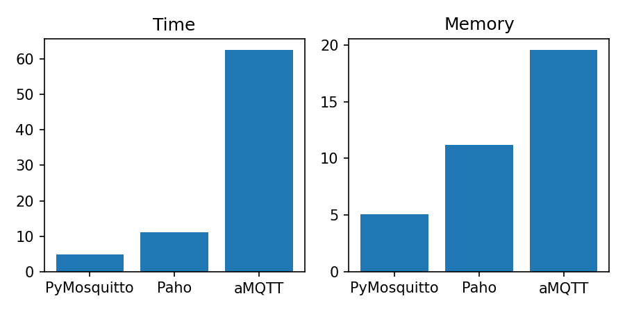

# PyMosquitto

Lightweight Python MQTT client implemented as a simple wrapper over libmosquitto.


## Dependencies

- python3.8+
- libmosquitto1


## Installation (in progress)

- pip install pymosquitto


## Usage

```python
from pymosquitto.client import MQTTClient


def on_message(client, userdata, msg):
    print(msg)


client = MQTTClient()
client.on_connect = lambda *_: client.subscribe("#", 1)
client.on_message = on_message
client.connect_async("localhost", 1883)
client.loop_forever()
```


## Benchmarks

Receiving 1 million messages with QoS 0.

*The Python interpreter overhead(~10.4 MB) has been excluded from the memory plot.



**benchmark.csv**

```text
Module;Time;RSS
pymosq;0:05.45;17724
paho;0:09.73;23252
aiomqtt;0:54.16;578064
amqtt;0;0
gmqtt;0:04.51;25152
```


## License

MIT
