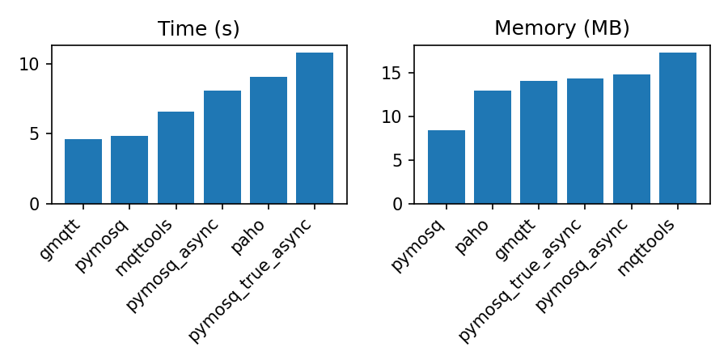

# PyMosquitto

A lightweight Python MQTT client implemented as a thin wrapper around libmosquitto.


## Dependencies

- python3.8+
- libmosquitto1


## Installation

- pip install pymosquitto


## TODO

- make async client (IN PROGRESS)
- implement the remaining bindings


## Usage

```python
from pymosquitto.client import MQTTClient


def on_message(client, userdata, msg):
    print(msg)


client = MQTTClient()
client.on_connect = lambda *_: client.subscribe("#", 1)
client.on_message = on_message
client.connect_async("localhost", 1883)
client.loop_forever()
```

Async client example:

```python
import asyncio

from pymosquitto.aio import AsyncMQTTClient


async def main():
    async with AsyncMQTTClient() as client:
        await client.connect("localhost", 1883)
        await client.subscribe("#", 1)
        async for msg in client.recv_messages():
            print(msg)


asyncio.run(main())
```

Check out more examples in `tests/test_client.py`.


## Benchmarks

Receiving 1 million messages with QoS 0.

*The memory plots exclude the Python interpreter overhead (~10.2 MB).


Losers excluded:



**benchmark.csv**

```text
Module;Time;RSS
pymosq;0:05.58;17268
pymosq_async;0:09.03;25024
paho;0:08.38;23364
gmqtt;0:05.48;24948
mqttools;0:05.82;28048
aiomqtt;0:51.85;572576
amqtt;0;0
```


## License

MIT
