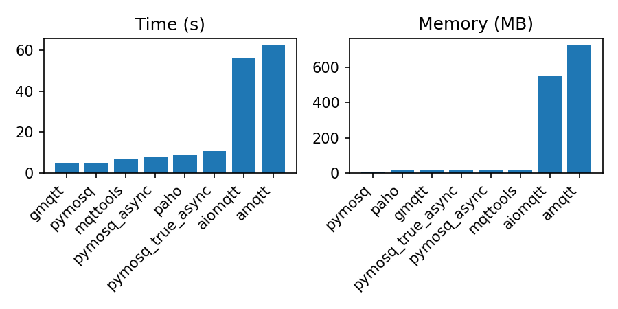

# PyMosquitto

A lightweight Python MQTT client implemented as a thin wrapper around libmosquitto.


## Dependencies

- python3.8+
- libmosquitto1


## Installation

- pip install pymosquitto


## TODO

- make async client
- implement the remaining bindings


## Usage

```python
from pymosquitto.client import MQTTClient


def on_message(client, userdata, msg):
    print(msg)


client = MQTTClient()
client.on_connect = lambda *_: client.subscribe("#", 1)
client.on_message = on_message
client.connect_async("localhost", 1883)
client.loop_forever()
```

Check out more examples in `tests/test_client.py`.


## Benchmarks

Receiving 1 million messages with QoS 0.

*The memory plots exclude the Python interpreter overhead (~10.2 MB).



Losers excluded:


**benchmark.csv**

```text
Python RSS: 10216
pymosq;0:04.35;17180
paho;0:09.27;23184
gmqtt;0:04.25;24972
aiomqtt;0:56.98;574220
amqtt;0;0
```


## License

MIT
